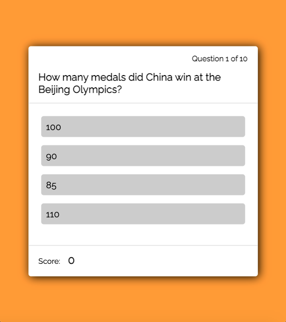
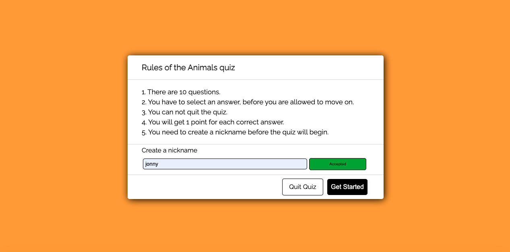
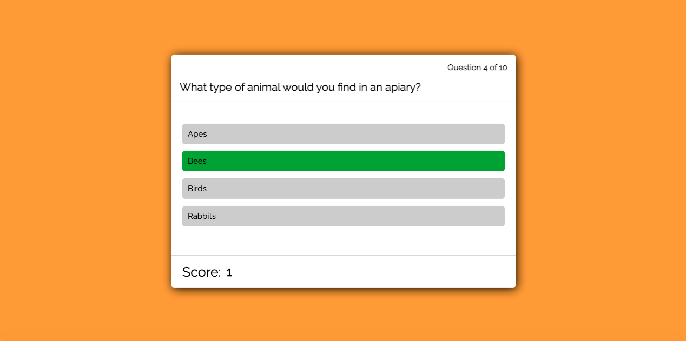
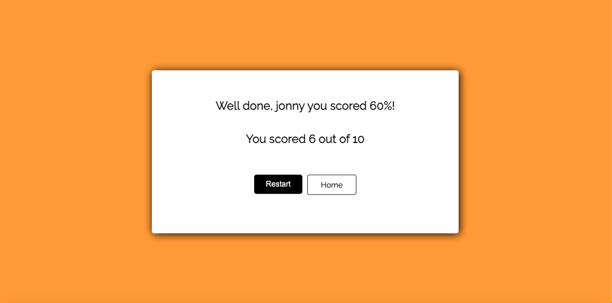

# Brain Power

## Introduction

This website presents Brain Power, which is a website that provides people with 12 different fun quiz's that they can play and test their knowledge. The design is simple and easy to use.

The main aim of this project was to produce a fun quiz website, which is responsive and easy to use by only using HTML, CSS and JAVASCRIPT.

## Table of contents
* [User goals](#user-goals)
* [Features](#Features)
* [Technology](#Technology)
* [Testing](#Testing)
* [Deployment](#Deployment)
* [Credits](#Credits)
* [Screenshots](#Screenshots)

# User Goals
## All User Goals
- User is able to easily navigate through the site.
- User is able to access any quiz easily.
- User is able to easily see their result from the quiz.
## Returning User Goals
- User is able to easily find a quiz they want to play.
- User is able to set their user name.
- User is able to play a different game, Love Maths.
## Website Owner Business Goals
- To have a fun selection of quiz's for users to play, with a random selection of questions for each round.
- To give users easy understandable rules for each quiz.
- To give users an understanding of how they did.
- To give users the opportunity to try out a different game, they have made.

# Features
## Clean Structure
The website is designed to give the user a great experience, with an easy to use design and to be user-friendly on all types of devices. There will be no difference in the experience users have when on a mobile compared to a laptop!

### Wire frames
I decided to draw out my initial wire frames.
#### Wire frames for Bigger Screens

#### Wire frames for Mobile Screens

##### Coloured in Wire frames

### Site Styles

#### Colours
* Background colour - #ff9d00 
* Secondary colour - #000000
* Text colour  - #000000
* Secondary text colour  - #ffffff
* Correct answer colour  - #00a30d
* Incorrect answer colour  - #c60606

#### Font

* For my font I used 'Raleway', with a backup of sans-serif.

#### Images

* For my images I used [Unsplash.com](https://unsplash.com) and they are credited in [credits](#credits) section.

[Back to Table of contents](#table-of-contents)

## Features of the Website: 
The website consists of 2 pages, 1 is the home page. The other page is accessible through the Homepage button (when a quiz is selected).

#### Home Page
* ##### Top Rated Quizzes
- This section holds 4 cards, each card has an image relating to the quiz.
- Each card has a hover effect which brings up the title of each quiz category.
- Each card in this section is pressable and will link to its relative quiz.

* ##### About Us 
- This section has a short paragraph to give our users an understanding about who we are (The creators).
-  It also shares our other game, love maths. It includes an image, which is a screenshot of the game. It also has a button that takes you to the game on a new tab.

* ##### Other Quiz Categories
- This section holds 8 cards, each card has an image relating to the quiz.
- Each card has a hover effect which brings up the title of each quiz category.
- These cards an non click able.

#### Quiz Pages
##### Welcome Page
- This section is made of a card which holds 4 blocks.
- The top block holds a title section which introduces you to your chosen quiz.
- The second block holds 5 rules.
- The third block allows you to create a nickname.
- And the final includes 2 buttons, one that lets you exit the quiz and one that starts the game.

##### Question Page
- This section is made of a card which holds 4 blocks.
- The first block lets you know which question you are on.
- The second Shows you the question.
- The 3rd has 4 buttons for the answers you can choose from.
- The final block includes the score. 

##### Score Page 
- This section is made of a card which holds 3 blocks.
- The first includes a comment depending on how well you did on the quiz and also includes the nickname the user creates on the welcome page.
- The second tells you what you scored out've 10.
- And the final includes 2 buttons, one that lets you restart the quiz and one that takes you to the home page.

[Back to Table of contents](#table-of-contents)

# Technology
### HTML5
* As a structure language.
### CSS
* As a style language
### Javascript
* As a scripting Language
### Font Awesome
* As an icon library for social links.
### Google Fonts
* As a font resource.
### GitHub
* As a software hosting platform to keep the project in a remote location.
### Git
* As a version-control system tracking.
### Gitpod
* As a development hosting platform.
### Adobe XD
* As a wireframing tool.
### Adobe Photoshop
* As an image editor.
### Adobe Illustrator
* As an illustration editor.

[Back to Table of contents](#table-of-contents)

# Testing
## Functionality Testing
I used Mozilla web developer tools and Chrome developer tools throughout the project for testing and solving problems with responsiveness and style issues.

## Compatibility Testing
The website was tested across multiple virtual mobile devices and browsers. I checked all supported devices in both web developer tools.

I tested on hardware devices such as: Apple Ipad 12 pro, Samsung S20 Ultra smart phone with Android 10 and used a Iphone 5 to compare the difference in size.

## User Stories Testing
### As the Website Owner
- To provide a fun selection of quiz's for anyone to play.
    >   The website has 12 quiz cards which are all working quiz's, which gives the user a large choice.
-  Have a great SEO website to help new people to find the website.
    >   With great SEO we will be at the top of most search engines which will help us get more support and clients.  

### As a New Player
- User is able to easily navigate through the site.
    >   User is able to find the navigation very easily on any screen size.
- User is able to find information out easily.
    >  User can find any information out very easily by scrolling to the about us section, which is on the home page. 

### As an Existing Player
- User is able to easily find the quiz's they want to play.
    >   User can find the quiz category they like playing easily. 
- User is able to try any quiz.
    >   There is not a limit on how many quiz's you can play.
- User can learn more about the company.
    >  User is able to find any information out easily, they can also access our other game from the home page.

___
## Issues Found During Site Development
- Images do not align properly. 

The images for the quiz do not line up, because the image heights are different. All images have the same class which give them height of 100%.

I decided to make all images the same height manually using Photoshop, I did this once I had made all images into webp file types.

- Quiz question and answers don't load.

The Quiz card is blank, nothing is loading up.

After looking in the script I noticed that there was a spelling mistake.

## Performance Testing
I used [Lighthouse](https://developers.google.com/web/tools/lighthouse/) tool to check performance of the website. I had to make a few changes that I needed to make to improve the scores. Screenshots and supporting text is presented below:

Initial screenshot

I ended up changing the images from webp to jpg and correctly sizing them which helped boost the performance. I also added keywords which helped with the SEO.

## Code Validation
At the end of the project I used 2 websites to validate the code.
 * [W3C CSS Validator](https://jigsaw.w3.org/css-validator/) to validate CSS
 * [Nu Html Checker](https://validator.w3.org/) to test HTML
 All code passed with no errors or warnings.

[Back to Table of contents](#table-of-contents)

# Deployment
The project was deployed on GitHub Pages. I used Gitpod as a development environment where I committed all changes to git version control system. I used push command in Gitpod to save changes into GitHub.

To deploy a project I had to:

* Log in to GitHub and click on repository to deploy ([brain-power-quiz-site](https://github.com/Jonnywdev/brain-power-quiz-site))
* Select `Settings` and find the Pages section at the second to bottom of the page's navigation menu on the left hand side of the screen. 
* From source select branch `main` and then the `root` folder.
* Click `save` and page was deployed after auto-refresh.
>  Your site is published at https://jonnywdev.github.io/brain-power-quiz-site/

To run locally:
* Log in to GitHub and click on repository to download ([brain-power-quiz-site](https://github.com/Jonnywdev/brain-power-quiz-site)
* Select `Code` and click Download the ZIP file.
* After download you can extract the file and use it in your local environment.

Alternatively you can [Clone](https://docs.github.com/en/free-pro-team@latest/github/creating-cloning-and-archiving-repositories/cloning-a-repository)
or [Fork](https://docs.github.com/en/free-pro-team@latest/github/getting-started-with-github/fork-a-repo)
this repository ([brain-power-quiz-site](https://github.com/Jonnywdev/brain-power-quiz-site) into your github account.

[Back to Table of contents](#table-of-contents)

# Credits
* To complete this project I used Code Institute student template: [gitpod full template](https://github.com/Code-Institute-Org/gitpod-full-template)

## Code:
* Hover effect on Quiz cards: [30secondsofcode.org](https://www.30secondsofcode.org/css/s/image-overlay-hover )

## Images

### Unsplash.com
* [sport.png](https://unsplash.com/photos/lk0T8KLxfqs)
* [film-tv.png](https://unsplash.com/photos/YvPxyGzaFJ4)
* [history.png](https://unsplash.com/photos/-rkf6Ducli8)
* [animal.png](https://unsplash.com/photos/UbjGsvEwnzc)
* [geography.png](https://unsplash.com/photos/WOF7xn1antA)
* [literature.png](https://unsplash.com/photos/sfL_QOnmy00)
* [food.png](https://unsplash.com/photos/6XmQV6GccYU)
* [science.png](https://unsplash.com/photos/3FtypNvSPn0)
* [cartoon.png](https://unsplash.com/photos/mou0S7ViElQ)
* [music.png](https://unsplash.com/photos/lDKmtwvrZZs)
* [travel.png](https://unsplash.com/photos/AQJ5cLTR_AM)

### Healthline.con
* [gen-know.png](https://www.healthline.com/health-news/heres-what-happens-when-you-remove-half-your-brain)

### Love Maths
* [Love maths game](https://jonnywdev.github.io/love-maths/)

[Back to Table of contents](#table-of-contents)

# Screenshots
## Project Screenshots

[Back to Table of contents](#table-of-contents)